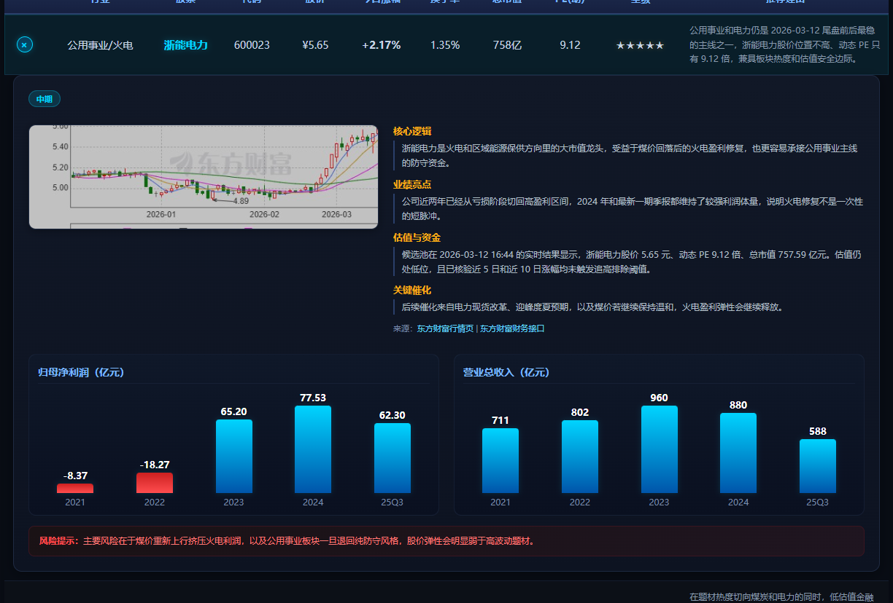

# china-stock-report

`china-stock-report` 不只是把股票名单塞进一个 HTML 模板，它的目标是生成一份**当天可交付、可追溯、可复盘**的 A 股推荐报告。

整个流程强制依赖 `china-stock-analysis` 的当天 raw output，再补齐当天行情、财务和 K 线截图，最终输出：

- 正式报告：`reports/stock_report_YYYYMMDD.html`
- 预览图片：`assets/YYYYMMDD/report_preview.png`

## 成品截图

### 总览页


### 展开详情页



## 这个 skill 解决的不是“生成页面”，而是“生成当天可信的推荐结论”

日常做一份像样的股票推荐报告，难点不在 HTML，而在前面的数据链路是否可信：

- 名单是不是当天动态筛出来的，而不是复用旧报告
- 价格、PE、市值、涨跌幅是不是本次实际抓到的数字
- K 线截图是不是当天重新抓的，而不是历史缓存
- 推荐理由是不是和当天板块热度、估值和业绩逻辑一致
- 如果当天某个关键数据源失败，系统会不会假装成功继续产出

`china-stock-report` 做的就是把这些步骤固定成一条流水线，尽量减少“看起来像报告、其实数据不可信”的情况。

## 推荐股票的规则

推荐名单不是固定池，也不是人工随手挑 6 只，而是按下面这套规则收敛出来：

1. 先跑当天板块热度和候选池。
   - 用 `sector_analyzer.py` 看当天哪些方向最强
   - 用 `stock_screener.py` 从候选池里筛出低估值、体量合适、流动性足够的股票

2. 只允许在当天候选池里选股。
   - raw 文件里的数字字段必须直接来自当天脚本输出
   - `verify_raw.js` 会强制比对价格、PE、市值和时间戳
   - 如果字段对不上，流程直接中止

3. 过滤追高和短线过热。
   - 近 5 个交易日累计涨幅 `>= 20%` 的股票直接排除
   - 近 10 个交易日累计涨幅 `>= 30%` 的股票直接排除
   - 当天接近涨停或已经涨停的票，优先换成同行业更稳的替代标的

4. 保证行业分散，不堆同一类资产。
   - 同一行业最多保留 2 只
   - 优先保证正式池里至少覆盖 3 个方向
   - 防止“6 只都在同一个热门题材里”的失真结果

5. 推荐理由必须和当天市场状态匹配。
   - 板块热度
   - 估值水平
   - 业绩拐点或盈利稳定性
   - 近期催化
   - 明确风险提示

## 为什么会推这些股票

这个 skill 的目标不是找“永远正确的股票”，而是找**在当天市场环境下，最有理由进入正式观察池的 6 只股票**。

一只股票能进最终报告，通常要同时满足几件事：

- 方向对：它所在行业和当天主线、资金风格或防守风格一致
- 估值不离谱：不是单纯追涨，而是有估值安全边际或明显低估值属性
- 基本面能支撑：财务数据至少能解释“为什么它值得写进正式报告”
- 有催化：政策、行业景气、订单、盈利修复或风格切换里，至少占一条
- 风险能说清：不是只写利好，还要把回撤风险、估值风险、政策风险写进去

换句话说，这份报告输出的不是“今天最涨的 6 只”，而是“今天最值得继续跟踪、并且逻辑能写得清楚的 6 只”。

## 复盘与反思是这套流程的另一半

这套 skill 不只负责“今天推荐什么”，还负责“推荐完之后到底对不对”。

它有一条专门的复盘链路：

- 每次生成新报告前，会扫描历史 `stock_report_*.html`
- 对已满 5 个交易日且还没复盘的报告，自动进入复盘队列
- 计算每只股票从推荐日到复盘日的涨跌幅
- 对亏损案例总结原因
- 把总结出的教训写回复盘文档，作为下一次筛选的约束条件

这个机制的价值不在于“猜对一次”，而在于不断回答下面这些问题：

- 是不是经常追到短期涨太多的票
- 是不是在某类板块上重复踩坑
- 是不是过度集中在一种风格
- 哪类推荐理由事后最经得起验证，哪类最容易失效

这也是它和普通“日报模板生成器”最大的区别之一。

## 流程亮点

### 1. 当天数据强约束

- 必须有当天 raw 文件
- 必须通过 raw 校验
- 行情和财务字段必须来自本次实时抓取
- K 线截图必须当天重抓

### 2. 失败就停，不拿旧数据兜底

只要下面任一环节失败，正式报告就必须停止：

- `china-stock-analysis`
- 东方财富行情/财务接口
- Playwright 截图

这条规则是为了防止系统在失败后偷偷回填旧数据，最后生成一份“形式正确、时间错误”的报告。

### 3. 正式交付不只是一份 HTML

默认会同时交付：

- `stock_report_YYYYMMDD.html`
- `report_preview.png`

这样可以直接在聊天或仓库里看效果，不必先本地打开 HTML。

## 仓库结构

```text
china-stock-report-publish/
├── README.md
└── skills/
    └── china-stock-report/
        ├── README.MD
        ├── SKILL.md
        ├── assets/
        ├── agents/openai.yaml
        ├── config/report.config.json
        ├── scripts/
        └── references/
```

## 依赖

- Node.js
- Python 3
- Playwright
- 已安装并可运行的 `china-stock-analysis` skill

## 如何安装

### 方式 1：通过 GitHub 子目录安装

如果对方环境支持官方 skill 安装脚本，可以从 GitHub 仓库里的 skill 子目录安装：

```bash
python <skill-installer>/scripts/install-skill-from-github.py \
  --url https://github.com/<你的用户名>/<你的仓库名>/tree/main/skills/china-stock-report
```

### 方式 2：手工安装

把仓库中的 `skills/china-stock-report` 整个目录复制到本机 skill 目录中：

- 新版文档路径通常是 `~/.agents/skills/`
- 你当前本机这套环境使用的是 `~/.codex/skills/`

## 环境变量

- `CHINA_STOCK_REPORT_ROOT`
  - 指向外部运行工作区
- `CHINA_STOCK_REPORT_CONFIG`
  - 指向自定义配置文件
- `STOCK_PLAYWRIGHT_PATH`
  - 指向可用的 Playwright 安装路径
- `STOCK_BROWSER_EXECUTABLE_PATH`
  - 指向本机 Chrome/Edge 可执行文件；未设置时会自动探测常见安装路径

## 快速测试

先校验 skill 结构：

```powershell
python -X utf8 C:\Users\58219\.codex\skills\.system\skill-creator\scripts\quick_validate.py `
  C:\Users\58219\china-stock-report-publish\skills\china-stock-report
```

再检查关键脚本语法：

```powershell
node --check C:\Users\58219\china-stock-report-publish\skills\china-stock-report\scripts\fetch_data.js
node --check C:\Users\58219\china-stock-report-publish\skills\china-stock-report\scripts\verify_raw.js
node --check C:\Users\58219\china-stock-report-publish\skills\china-stock-report\scripts\build_analysis_from_raw.js
node --check C:\Users\58219\china-stock-report-publish\skills\china-stock-report\scripts\screenshot.js
node --check C:\Users\58219\china-stock-report-publish\skills\china-stock-report\scripts\capture_report_preview.js
node --check C:\Users\58219\china-stock-report-publish\skills\china-stock-report\scripts\generate_report_html.js
```

## 生成测试

安装后，可用类似提示词触发：

```text
Use $china-stock-report to validate today's raw stock analysis input and generate stock_report_YYYYMMDD.html with a preview PNG.
```
