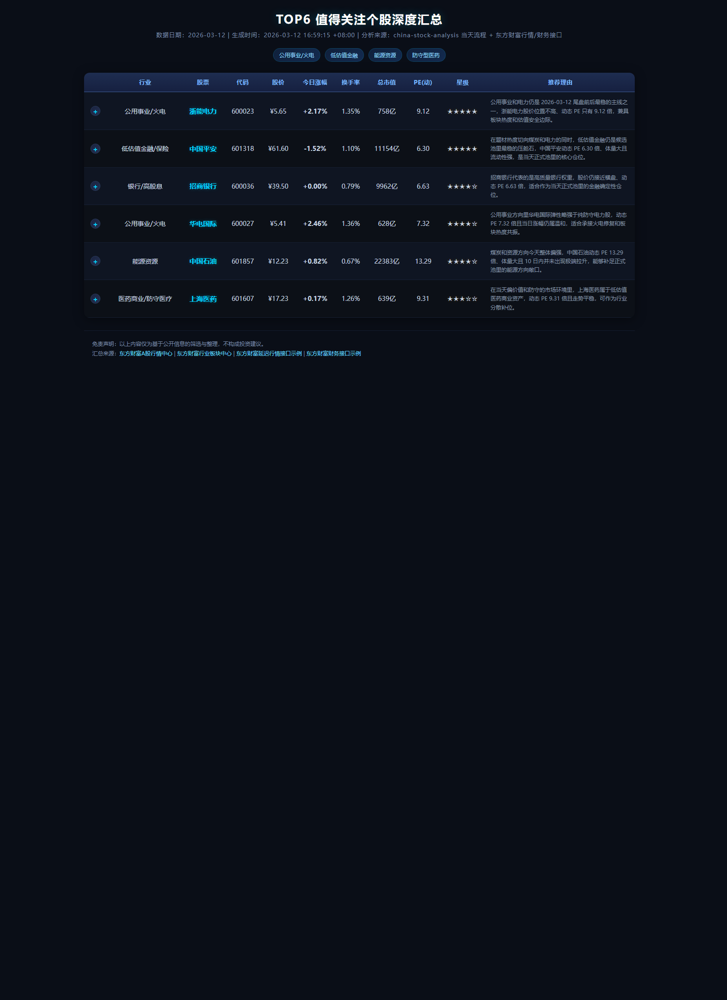

# China Stock Report

基于当天 `china-stock-analysis` raw 输出，生成 A 股正式推荐 HTML，并附带可直接查看的 PNG 预览图。

## 成品预览

对应正式产物：

- HTML：`reports/stock_report_20260312.html`
- 预览图：`assets/20260312/report_preview.png`

## 最短使用路径

1. 生成当天 raw：`data/raw/china_stock_analysis_raw_YYYYMMDD.json`
2. 校验 raw：`node scripts/verify_raw.js --date YYYYMMDD`
3. 生成分析底稿：`node scripts/build_analysis_from_raw.js --date YYYYMMDD`
4. 重抓 K 线截图：`node scripts/screenshot.js --date YYYYMMDD --concurrency 3 --stocks '[...]'`
5. 生成正式 HTML：`node scripts/generate_report_html.js --date YYYYMMDD`
6. 生成成品预览：`node scripts/capture_report_preview.js --date YYYYMMDD`

## 默认交付

- 正式 HTML：`reports/stock_report_YYYYMMDD.html`
- 成品预览：`assets/YYYYMMDD/report_preview.png`

如果当天 raw、行情补数、截图任一步失败，必须立即停止，不能回填旧数据交付。
